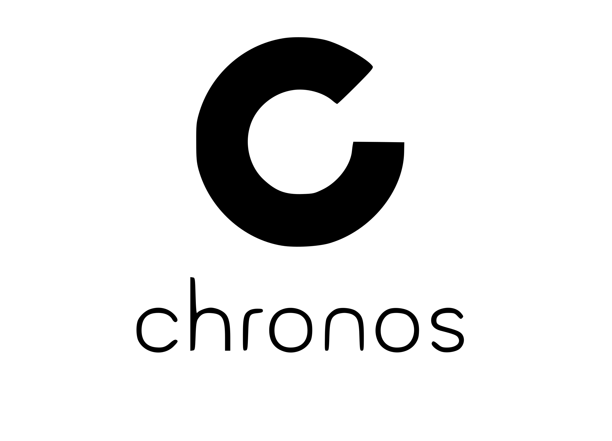

# CHRONOS

---

**Universidad Autónoma de Yucatán**  
**Facultad de Matemáticas**  
**Licenciatura en Ingeniería de Software**

---

## 🎯 Objetivo

Desarrollar una aplicación web multiplataforma que transforme la gestión de tareas en un sistema integral de desarrollo de hábitos productivos, incorporando elementos de gamificación y herramientas de bienestar para mejorar la productividad personal y grupal.

---

## 🎯 Alcance

El proyecto CHRONOS abarca el desarrollo de una aplicación web completa que incluye:

- Sistema de gestión de tareas con categorización dinámica
- Gamificación integral con puntos, niveles y logros
- Herramientas de bienestar y productividad personal
- Funcionalidades de colaboración grupal
- Calendario integrado y sistema de notificaciones
- Interfaz responsive para múltiples dispositivos
- Modo offline básico para funcionalidad esencial

**Limitaciones del alcance:**

- No incluye gestión financiera o contabilidad
- Funcionalidad offline limitada a operaciones básicas
- Capacidad de almacenamiento limitada para archivos grandes

---

## 📚 Tabla de Contenido

### [Rúbrica Segunda Entrega](https://alumnosuady-my.sharepoint.com/:x:/g/personal/a25216452_alumnos_uady_mx/EVNjlEMTeRRChKTQud9XIEYBg__RAUGntTlEbQBo44SNdg?e=4wxseh)

### 1. [Producto](producto/)

- [Descripción del Producto](producto/descripcion.md)
- [Usuarios / Clientes](producto/usuarios.md)
- [Propuesta de Valor](producto/propuesta-valor.md)

### 2. [Requisitos](requisitos/)

- [Requisitos Funcionales](requisitos/funcionales.md)
- [Requisitos No Funcionales](requisitos/no-funcionales.md)
- [Priorización](requisitos/priorizacion.md)
- [Artefactos](requisitos/artefactos.md)

### 3. [Proceso](proceso/)

- [Métrica de Contribución Individual](https://alumnosuady-my.sharepoint.com/:x:/g/personal/a25216452_alumnos_uady_mx/EasHvR7dMItBuxfOiwcSyuIBT_sD_jSaBle9HIRzSE8VZQ?e=2I29Bj)

### 4. [Presentación del Avance](https://www.canva.com/design/DAG4Qqz-uJc/KoSJqR5ZA2mq8qpdoCUruw/edit?utm_content=DAG4Qqz-uJc&utm_campaign=designshare&utm_medium=link2&utm_source=sharebutton)

### 5. [Competencias](competencias/)

- [Competencias Genéricas](competencias/genericas.md)
- [Competencias Específicas](competencias/especificas.md)

## Scrum

### [Product Backlog y Sprint Tracking General](https://alumnosuady-my.sharepoint.com/:x:/g/personal/a25216452_alumnos_uady_mx/EasHvR7dMItBuxfOiwcSyuIBT_sD_jSaBle9HIRzSE8VZQ?e=9vLwdt)

### 1. [Sprint 1 Diseño](Scrum/sprint-1/)

#### Daily Scrum

- [Playlist Daily Scrum](https://www.youtube.com/playlist?list=PLKGXBt1VDmtNhxKvR0-1Swn4W1n8uFwnx)

- [Reunión #1](Scrum/sprint-1/reunión-1.mp4)
- [Día 1](Scrum/sprint-1/dia_1.mp4)
- [Día 2](Scrum/sprint-1/dia_2.mp4)
- [Día 3](Scrum/sprint-1/dia_3.mp4)
- [Día 4](Scrum/sprint-1/dia_4.mp4)
- [Día 5](Scrum/sprint-1/dia_5.mp4)

#### Product Backlog y Sprint 1 Traking

- [Interfaces](https://alumnosuady-my.sharepoint.com/:b:/g/personal/a25216452_alumnos_uady_mx/EaloQFLVnm1Hrv2kbIMYyugBmzodblQiJUpqYnwKRx5tdQ?e=ct6LaC)

- [Product Backlog](Scrum/sprint-1/P-Backlog.md)
- [Sprint Tracking](Scrum/sprint-1/Sprint-Tracking.md)

### 2. [Sprint 2 User Research](Scrum/sprint-2/)

- Daily Scrum

- [Playlist Daily Scrum](https://youtube.com/playlist?list=PLKGXBt1VDmtM4mtU2msXJawkn1VKvVSgd&si=BgPTEExhclD8Qs6o)

#### Product Backlog y Sprint 2 Traking

- [Product Backlog](Scrum/sprint-2/P-Backlog.md)
- [Sprint Tracking](Scrum/sprint-2/Sprint-Tracking.md)

## [Prueba de Usabilidad](/Prueba%20de%20Usabilidad/)

## 👥 Equipo de Desarrollo

### Integrantes

- **CAUICH MEDINA CARLOS JESÚS**
- **ITZA LÓPEZ AZUL VALERIA**
- **LAVADORES GRANIEL ANA REGINA**
- **PEÑA GARCÍA GUILLERMO**
- **PUC CHAN EDRICK MISAEL**

### Profesora

- **CABALLERO CHI LEYDI OFELIA**

### Fecha de Inicio

- **29 de Septiembre de 2025**

---

**CHRONOS** - *Organizando el tiempo, construyendo hábitos productivos* ⏰✨
